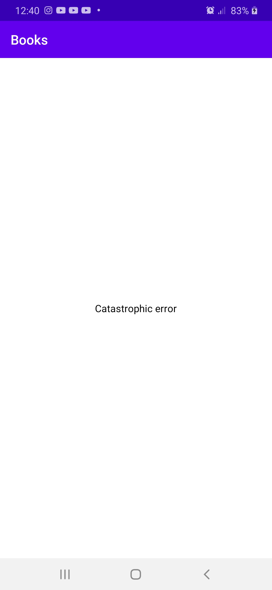

# Layout
   

# Welcome to Ny Books App!

This project consume an [API -The New York Times](https://developer.nytimes.com/docs/books-product/1/overview) to list books. 
Project created to demonstrate some android apps development concepts. (personal) 

# Project
This project make use some technologies requested by market to help in some scenarios that simulate day to day of a android developer

# Technologies
This project use the follow technologies and tools:
- [Retrofit](https://square.github.io/retrofit/) - Retrofit is the class through which your API interfaces are turned into callable objects.
- [Moshi](https://github.com/square/moshi/) - Moshi is a modern JSON library for Android and Java.
- [MVVM Architecture](https://medium.com/upday-devs/android-architecture-patterns-part-3-model-view-viewmodel-e7eeee76b73b) - Model-View-ViewModel Pattern.
- [Mockito](https://developer.android.com/training/testing/unit-testing/local-unit-tests#java) - If your test needs to interact with Android dependencies, include the Mockito library to simplify your local unit tests.

[For mode details click here](https://developer.android.com/jetpack/)
